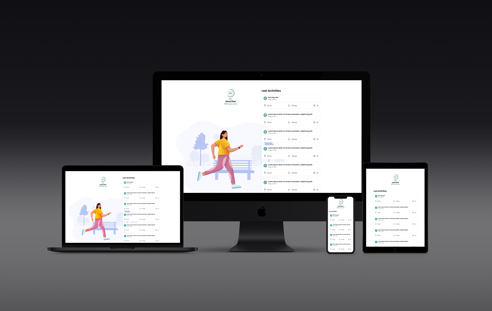

## GameAthlon

Web responsive para gamificar las actividades deportivas. Cada kilómetro recorrido se convierte en puntos de experiencia que permitirán al usuario subir de nivel y ganar coins.

### API
Strava https://developers.strava.com/

### Funcionalidades
- Login
- Consulta de últimas actividades
- Cálculo de nivel y coins

### Vistas
- Login de usuario
- Home de usuario donde se mostrará el nivel y los coins ganados con un listado de las últimas actividades realizadas.
- Detalle de cada actividad (se muestra al hacer click en una actividad)

### Tecnologías
SCSS, JS Vanilla, Gulp, Handlebars

## Desarrollo

1. En el terminal ir a la carpeta `/gulp`
2. Ejecutar `npm install` (sólo la primera vez)
3. Ejecutar `gulp default`
4. Ir a `http://localhost:3000/`

La web se refrescará automáticamente cuando se realicen cambios.
